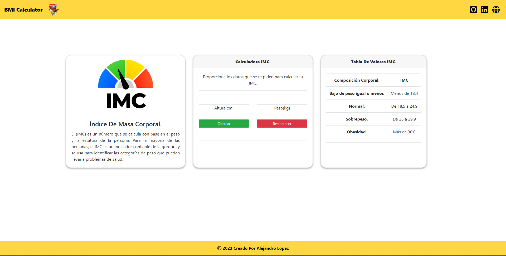

# <h1 align="center" style="color: #80cbc4;"> BMI Calculator 👨🏻‍💻 </h1> 
  

` The (BMI)` is a number that is calculated based on a person's weight and height. For most people, the BMI is a reliable indicator of fatness and is used to identify weight categories that can lead to health problems.

      

  

## 
 Requirements 

- [HTML5](https://developer.mozilla.org/es/docs/Web/HTML) 
- [CSS3](https://developer.mozilla.org/es/docs/Web/CSS)
- [JavaScript](https://developer.mozilla.org/es/docs/Web/JavaScript)
- [BootStrap](https://mdbootstrap.com/)
- [SweetAlert2](https://sweetalert2.github.io/)

  

## 
 Screenshot Project 💻 

🔶 [Project Website](https://alejandro-190107.github.io/BMI-Calculator/)

